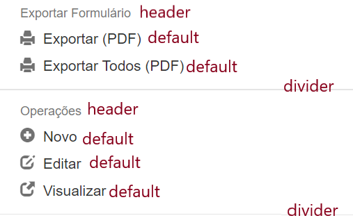

# Reportmenuitem
{: .no_toc }


Itens do tipo reportmenuitem representam uma opção que é mostrada para o usuário quando ele clica em algum registro nas partes `analítico` ou `estatísticas` do módulo.
{: .fs-6 .fw-300 }

<div class="code-example" markdown="1">

Exemplo: 

</div>

## Índice
{: .no_toc .text-delta }

1. TOC
{:toc}

---


## Propriedades Específicas

A tabela abaixo lista todas as propriedades específicas a itens do tipo `reportmenuitem`.

| Propriedade           | Tipo      | Descrição                                                        |
|:----------------------|:----------|:-----------------------------------------------------------------|
| `rmi_type`                | `string`  |Informa o tipo de `reportmenuitem` a ser utilizado. Default = `default`.  [Clique aqui](#rmi_type) para mais detalhes.
| `rmi_icon`                | `string`  |Informa a imagem de ícone que deverá ser utilizada juntamente ao tipo `default`. [Clique aqui](#rmi_icon) para mais detalhes.
| `rmi_targetreport`          | `string`    |Informa em qual dos relatórios o item deve aparecer: analítico, estatísticas ou ambos. Os valores possíveis para o campo são `analytical`, `synthetic` e `both`. Default = `analytical`
| `rmi_executionmode` | `string`    |Informa se o modo de execução do item deve ser síncrono ou assíncrono, tendo como valores possívels `synchronous` e `asynchronous`. Default = `synchronous`.
| `rmi_reportmenuitem_CSharpCode` | `string`    |Importa o código C# correspondente às ações do `reportmenuitem` de tipo `default`. O texto deve possuir o formato `'@ import reportmenuitem.cs`, podendo alterar o nome do arquivo, que deve estar na mesma pasta que o `Form Designer.xlsm` utilizado. Default = [Clique aqui](#reportmenuitem_csharpcode) para mais detalhes.

---

## Propriedades Básicas

Itens do tipo `reportmenuitem` também aceitam propriedades básicas de itens. [Clique aqui](basicproperties.md) para conhecê-las.

---

## Propriedades Específicas - Detalhamento

### `rmi_type`

A propriedade `rmi_type` representa o tipo de item a ser utilizado. As possibilidades estão listadas abaixo, tal como suas definições:

- `divider`: É utilizado para criar um traço entre as diferentes sessões de `reportmenuitem`.
- `header`: É utilizado como um cabeçalho para as diferentes sessões de `reportmenuitem`.
- `default`: É utilizado para criar uma opção que, ao ser clicada, executa o código C# correspondente às ações que ela deve realizar.

Na imagem abaixo, o texto em vermelho indica o respectivo `rmi_type` dos elementos:

<div class="code-example" markdown="1">
  
</div>


### `rmi_icon`

Dentro da pasta do Google Drive compartilhada pela GlobalCad com os developers, há a documentação completa de todos os ícones disponíveis para a versão Mobile e para a versão Web do módulo. Há dois arquivos `.PDF` e uma pasta com os ícones do Mobile em forma de imagem `.PNG` (para que o nome possa ser buscado com mais facilidade) na seguinte localização:

```
0-DEVELOPERS\FORM_DESIGNER\ICONS CATALOG
```

### `reportmenuitem_CSharpCode`

Além de importar o código, o programador também possui a opção de escrever diretamente na barra superior da própria planilha, no mesmo local onde há um código de exemplo. Abaixo, se encontra o código C# base que deve ser utilizado para o desenvolvimento. O comentário com as reticências representa o local onde será inserido o código personalizado:

```
using System;
using System.IO;
using System.Text;
using System.Data;
using System.Linq;
using System.Globalization;
using System.Collections.Generic;
using System.Runtime.Serialization.Formatters.Binary;
using Newtonsoft.Json.Linq;
using Project.WebHost.Db;
using Project.WebHost.Cad;
using Project.WebHost.Web;
using Project.WebHost.ZIP;
using Project.WebHost.Common;
using Project.WebHost.Report;
using Project.WebHost.KmlEngine;
using Project.WebHost.Utils.Storage;
using Project.WebHost.LocalTaskManager;
using Project.WebHost_Providers.Common;
using Project.WebHost_Providers.GenericProvider.Model;
using Project.WebHost_Providers.GenericProvider.Model.Items;
using Project.WebHost_Providers.GenericProvider.Utils;
using Project.WebHost_Providers.GenericProvider.Model.Database;
using SelectPdf;
using GemBox.Presentation;
namespace CustomCode
{
    public class CustomCode_reportmenuitem
    {
        static public void Main(object[] parms)
        {
            CallerData callerData = (CallerData)parms[0];
            Form form = (Form)parms[1];
            decimal defaultContract = (decimal)parms[2];
            decimal formNumber = (decimal)parms[3];
            string VALUESTableName = (string)parms[4];
            string DICTTableName = (string)parms[5];
            string USERSTableName = (string)parms[6];
            string HEADERSTableName = (string)parms[7];
            ReportDefinition reportDefinition = (ReportDefinition)parms[8];
            ProviderProject.ReportIDs reportType = (ProviderProject.ReportIDs)parms[9];
            ReportFilter[] filtersToApply = (ReportFilter[])parms[10];
            IsvCadProvider svCadProvider = (IsvCadProvider)parms[11];
            GetSetCadInputData getSetCadInputData = (GetSetCadInputData)parms[12];
            ProviderProject providerProject = (ProviderProject)parms[13];
            DataRow selectedRow = (DataRow)parms[14];
            Dictionary<int, long> dbIDs = (Dictionary<int, long>)parms[15];  // IDs do banco de dados associados a cada ID do item ([item ID] -> [database ID]).
            List<int> sortedDbIDsKeys = (List<int>)parms[16];
            int PARENT_CONTAINER_ITEMID = (int)parms[17];  // PARENT_CONTAINER_ITEMID representado pela linha clicada.
            dynamic actions = (dynamic)parms[18];  // Populado com as ações a serem performadas depois que a execução deste método é encerrada. Use a classe ServerActionUtils para inserir ações neste objeto.
            ReportMenuItem rmItem = (ReportMenuItem)parms[19];
            ProviderProject.ReportIDs reportID = (ProviderProject.ReportIDs)parms[20];
            int[] visibleFields = (int[])parms[21];
            
            //...
            
        }
    }
}

```

---

## Reportmenuitem - Exemplo 1

A tela abaixo revela uma sessão que contém dois botões de `reportmenuitem` chamados de <mark>Aprovar Despesa</mark> e <mark>Reprovar Despesa</mark>.

<div class="code-example" markdown="1">


</div>
```markdown
[
  {
    "id": 10,
    "type": "reportmenuitem",
    "text": "Divisor",
    "rmi_tipe": "divider"
  },
  {
    "id": 20,
    "type": "reportmenuitem",
    "text": "Aprovação",
    "rmi_tipe": "header"
  },
  {
    "id": 30,
    "type": "reportmenuitem",
    "text": "Aprovar Despesa",
    "rmi_tipe": "default",
    "rmi_icon": "glyphicon_ok_sign",
    "reportmenuitem_CSharpCode": "reportmenuitemAprovacao.cs"
  },
  {
    "id": 40,
    "type": "reportmenuitem",
    "text": "Reprovar Despesa",
    "rmi_tipe": "default",
    "rmi_icon": "glyphicon_remove_sign",
    "reportmenuitem_CSharpCode": "reportmenuitemAprovacao.cs"
  }
]
```
